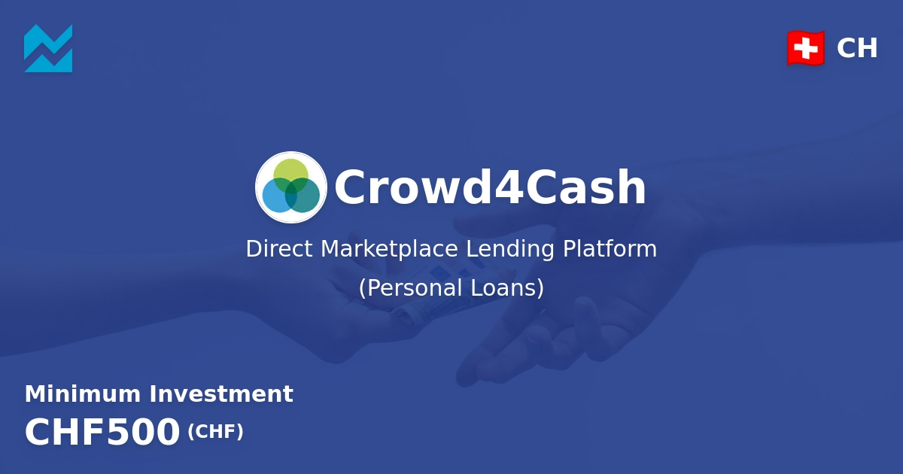

<div align="center">

[](https://crowd4cash.ch&#x2F;)

# [Crowd4cash](https://crowd4cash.ch&#x2F;)<a id="crowd4cash"></a>

Access to the Crowd4Cash Crowdlending Platform through an API

</div>

## Table of Contents<a id="table-of-contents"></a>

<!-- toc -->

- [Installation](#installation)
- [Getting Started](#getting-started)
- [Reference](#reference)
  * [`crowd4cash.application.setDefinitiveHandoverDate`](#crowd4cashapplicationsetdefinitivehandoverdate)
  * [`crowd4cash.application.submitLoanApplication`](#crowd4cashapplicationsubmitloanapplication)
  * [`crowd4cash.application.submitPartnerLoanApplication`](#crowd4cashapplicationsubmitpartnerloanapplication)
  * [`crowd4cash.application.submitRentalLoanApplication`](#crowd4cashapplicationsubmitrentalloanapplication)
  * [`crowd4cash.authentication.getToken`](#crowd4cashauthenticationgettoken)
  * [`crowd4cash.bidding.placeBid`](#crowd4cashbiddingplacebid)
  * [`crowd4cash.bidding.submitBids`](#crowd4cashbiddingsubmitbids)
  * [`crowd4cash.contracts.getAll`](#crowd4cashcontractsgetall)
  * [`crowd4cash.contracts.getLoanContract`](#crowd4cashcontractsgetloancontract)
  * [`crowd4cash.contracts.getSpecific`](#crowd4cashcontractsgetspecific)
  * [`crowd4cash.contracts.getSpecificIntermediaryLoanContract`](#crowd4cashcontractsgetspecificintermediaryloancontract)
  * [`crowd4cash.loans.getLoanData`](#crowd4cashloansgetloandata)
  * [`crowd4cash.opportunities.getAvailableInvestments`](#crowd4cashopportunitiesgetavailableinvestments)
  * [`crowd4cash.portfolio.getCustomizedPortfolio`](#crowd4cashportfoliogetcustomizedportfolio)
  * [`crowd4cash.portfolio.getInvestments`](#crowd4cashportfoliogetinvestments)
  * [`crowd4cash.reports.getConnectorInvestments`](#crowd4cashreportsgetconnectorinvestments)
  * [`crowd4cash.reports.getIntermediaryData`](#crowd4cashreportsgetintermediarydata)
  * [`crowd4cash.reports.rentalAccountSummary`](#crowd4cashreportsrentalaccountsummary)

<!-- tocstop -->

## Installation<a id="installation"></a>
<div align="center">
  <a href="https://konfigthis.com/sdk-sign-up?company=Crowd4Cash&language=TypeScript">
    
  </a>
</div>

## Getting Started<a id="getting-started"></a>

```typescript
import { Crowd4Cash } from "crowd-4-cash-typescript-sdk";

const crowd4cash = new Crowd4Cash({
  // Defining the base path is optional and defaults to https://api2.crowd4cash.ch
  // basePath: "https://api2.crowd4cash.ch",
  apiKey: "API_KEY",
});

const setDefinitiveHandoverDateResponse =
  await crowd4cash.application.setDefinitiveHandoverDate({
    loanId: 4989,
    handoverDate: "25.01.2023",
  });

console.log(setDefinitiveHandoverDateResponse);
```

## Reference<a id="reference"></a>


### `crowd4cash.application.setDefinitiveHandoverDate`<a id="crowd4cashapplicationsetdefinitivehandoverdate"></a>

**Note**: It's valid only for loans made indirectly through the intermediary.

#### 🛠️ Usage<a id="🛠️-usage"></a>

```typescript
const setDefinitiveHandoverDateResponse =
  await crowd4cash.application.setDefinitiveHandoverDate({
    loanId: 4989,
    handoverDate: "25.01.2023",
  });
```

#### ⚙️ Parameters<a id="⚙️-parameters"></a>

##### loanId: `number`<a id="loanid-number"></a>

Loan ID

##### handoverDate: `string`<a id="handoverdate-string"></a>

The date when the car is handed over to the subscriber

#### 🔄 Return<a id="🔄-return"></a>

[ApplicationResult](./models/application-result.ts)

#### 🌐 Endpoint<a id="🌐-endpoint"></a>

`/IntermediaryLoan` `PUT`

[🔙 **Back to Table of Contents**](#table-of-contents)

---


### `crowd4cash.application.submitLoanApplication`<a id="crowd4cashapplicationsubmitloanapplication"></a>

**Note**: Approval and funding times vary, but typically it takes only 24 hours.

#### 🛠️ Usage<a id="🛠️-usage"></a>

```typescript
const submitLoanApplicationResponse =
  await crowd4cash.application.submitLoanApplication();
```

#### 🔄 Return<a id="🔄-return"></a>

[ApplicationResult](./models/application-result.ts)

#### 🌐 Endpoint<a id="🌐-endpoint"></a>

`/Loan` `POST`

[🔙 **Back to Table of Contents**](#table-of-contents)

---


### `crowd4cash.application.submitPartnerLoanApplication`<a id="crowd4cashapplicationsubmitpartnerloanapplication"></a>

**Note**: Each successful application creates a binding obligation on you. Once you apply you may not retract the application.

#### 🛠️ Usage<a id="🛠️-usage"></a>

```typescript
const submitPartnerLoanApplicationResponse =
  await crowd4cash.application.submitPartnerLoanApplication({
    partnerId: 12225,
    purchaseItem: "Car",
    itemStatus: "Rented",
    itemName: "BMW 318D e90",
    itemType: "Saloon",
    itemBrand: "BMW",
    itemModel: "318D",
    itemColor: "Black",
    itemMarketValue: 10000,
    manufactureDate: "13.05.2020",
    firstRegistration: "15.01.2021",
    mileage: "24000 km",
    itemCertificate: "1AA123",
    serialNumber: "WBAVB12345KS12345",
    identificationNumber: "630.830.709",
    rentalAmount: 420,
    handoverDate: "23.01.2023",
  });
```

#### ⚙️ Parameters<a id="⚙️-parameters"></a>

##### serialNumber: `string`<a id="serialnumber-string"></a>

Serial number (aka VIN or Chassis No.)

##### identificationNumber: `string`<a id="identificationnumber-string"></a>

Identification number (aka Stammnummer)

##### partnerId: `number`<a id="partnerid-number"></a>

ID of the partner that is buying an item. This ID can be taken from the Report endpoint and Intermediary route.

##### purchaseItem: `string`<a id="purchaseitem-string"></a>

Description of the item you buy e.g. Car

##### itemStatus: `string`<a id="itemstatus-string"></a>

Status of the item

##### itemName: `string`<a id="itemname-string"></a>

Name of the item

##### itemType: `string`<a id="itemtype-string"></a>

Type of the item e.g. SUV, Van, Saloon, Cabriolet etc.

##### itemBrand: `string`<a id="itembrand-string"></a>

Brand of the item

##### itemModel: `string`<a id="itemmodel-string"></a>

Model of the item

##### itemColor: `string`<a id="itemcolor-string"></a>

Color of the item

##### itemMarketValue: `number`<a id="itemmarketvalue-number"></a>

Market value of the item you want to buy. Please notice that the Loan Amount will be 80% of this value.

##### manufactureDate: `string`<a id="manufacturedate-string"></a>

Date when the car was manufactured

##### firstRegistration: `string`<a id="firstregistration-string"></a>

Date when the item was registered very first time

##### mileage: `string`<a id="mileage-string"></a>

Mileage of the item

##### itemCertificate: `string`<a id="itemcertificate-string"></a>

Certificate of the item

##### rentalAmount: `number`<a id="rentalamount-number"></a>

Rental amount per month

##### handoverDate: `string`<a id="handoverdate-string"></a>

The expected/approximate handover date (date when the car is expected to be handed over to the subscriber). Expected format: dd.MM.yyyy

#### 🔄 Return<a id="🔄-return"></a>

[ApplicationResult](./models/application-result.ts)

#### 🌐 Endpoint<a id="🌐-endpoint"></a>

`/IntermediaryLoan` `POST`

[🔙 **Back to Table of Contents**](#table-of-contents)

---


### `crowd4cash.application.submitRentalLoanApplication`<a id="crowd4cashapplicationsubmitrentalloanapplication"></a>

**Note**: Each successful application creates a binding obligation on you. Once you apply you may not retract the application.

#### 🛠️ Usage<a id="🛠️-usage"></a>

```typescript
const submitRentalLoanApplicationResponse =
  await crowd4cash.application.submitRentalLoanApplication({
    apiRequester: "Otto Schneider",
    renteeGender: "F",
    renteeFirstName: "Emma",
    renteeLastName: "Müller",
    renteeBirthdate: "23.09.1972",
    renteeEmail: "username@domainname.ch",
    renteeMobilePhoneNumber: "91100201",
    renteeStreetAddress: "Täfernstrasse",
    renteeHouseNumber: "4",
    renteeZipCode: "5405",
    renteeCity: "Dättwil",
    purchaseItem: "Electric Scooter",
    itemStatus: "Rented",
    itemName: "Vespino Go, 500W",
    itemType: "Electric Scooter",
    itemBrand: "Piaggio",
    itemModel: "Vespino Go",
    itemColor: "Green",
    itemMarketValue: 10000,
    serialNumber: "WBAVB12345KS12345",
    identificationNumber: "630.830.709",
    rentalAmount: 500,
    rentDate: "23.01.2023",
    idFrontPhoto: "/9j/4AAQSkZJRgABAQEASABIAAD/...",
    idFrontExtension: "jpg",
    idBackPhoto: "/9j/4AAQSkZJRgABAQEASABIAAD/...",
    idBackExtension: "jpg",
    selfiePhoto: "/9j/4AAQSkZJRgABAQEASABIAAD/...",
    selfieExtension: "jpg",
    contractFile: "JVBERi0xLjUKJeLjz9MKMyAwIG9...",
    contractFileExtension: "pdf",
  });
```

#### ⚙️ Parameters<a id="⚙️-parameters"></a>

##### renteeGender: `string`<a id="renteegender-string"></a>

Rentee gender acronym. M stands for male and F for female.

##### renteeFirstName: `string`<a id="renteefirstname-string"></a>

First name of the rentee

##### renteeLastName: `string`<a id="renteelastname-string"></a>

Last name of the rentee

##### renteeEmail: `string`<a id="renteeemail-string"></a>

E-mail address of the rentee

##### renteeMobilePhoneNumber: `string`<a id="renteemobilephonenumber-string"></a>

Rentee mobile phone number - the last 8 digits only

##### purchaseItem: `string`<a id="purchaseitem-string"></a>

Description of the item you buy

##### itemName: `string`<a id="itemname-string"></a>

Name of the item

##### itemMarketValue: `number`<a id="itemmarketvalue-number"></a>

Market value of the item that is rented.

##### rentalAmount: `number`<a id="rentalamount-number"></a>

Rental amount per month

##### idFrontPhoto: `string`<a id="idfrontphoto-string"></a>

Front Side of the Identity Document (National ID, Passport or Permit). Please notice that you must first convert it to Base64 and then send to our API.

##### idFrontExtension: `string`<a id="idfrontextension-string"></a>

Front Side file extension.

##### idBackPhoto: `string`<a id="idbackphoto-string"></a>

Back Side of the Identity Document (National ID, Passport or Permit). Please notice that you must first convert it to Base64 and then send to our API.

##### idBackExtension: `string`<a id="idbackextension-string"></a>

Back Side file extension.

##### selfiePhoto: `string`<a id="selfiephoto-string"></a>

Selfie of the Rentee. Please notice that you must first convert it to Base64 and then send to our API.

##### selfieExtension: `string`<a id="selfieextension-string"></a>

Selfie file extension.

##### contractFile: `string`<a id="contractfile-string"></a>

Copy of the Contract. Please notice that you must first convert it to Base64 and then send to our API.

##### contractFileExtension: `string`<a id="contractfileextension-string"></a>

Contract file extension.

##### apiRequester: `string`<a id="apirequester-string"></a>

Name or E-mail of the user who makes the API call

##### renteeBirthdate: `string`<a id="renteebirthdate-string"></a>

Birthdate of the rentee. Expected format: dd.MM.yyyy

##### renteeStreetAddress: `string`<a id="renteestreetaddress-string"></a>

Street address of the rentee

##### renteeHouseNumber: `string`<a id="renteehousenumber-string"></a>

House number of the rentee

##### renteeZipCode: `string`<a id="renteezipcode-string"></a>

Zip code of the rentee

##### renteeCity: `string`<a id="renteecity-string"></a>

City of the rentee

##### itemStatus: `string`<a id="itemstatus-string"></a>

Status of the item

##### itemType: `string`<a id="itemtype-string"></a>

Type of the item e.g. Electric Scooter, E-Motorcycle etc.

##### itemBrand: `string`<a id="itembrand-string"></a>

Brand of the item

##### itemModel: `string`<a id="itemmodel-string"></a>

Model of the item

##### itemColor: `string`<a id="itemcolor-string"></a>

Color of the item

##### serialNumber: `string`<a id="serialnumber-string"></a>

Serial number (aka VIN or Chassis No.)

##### identificationNumber: `string`<a id="identificationnumber-string"></a>

Identification number (aka Stammnummer)

##### rentDate: `string`<a id="rentdate-string"></a>

The first date of the rental period. Expected format: dd.MM.yyyy

#### 🔄 Return<a id="🔄-return"></a>

[RentalApplicationResult](./models/rental-application-result.ts)

#### 🌐 Endpoint<a id="🌐-endpoint"></a>

`/RentalLoan` `POST`

[🔙 **Back to Table of Contents**](#table-of-contents)

---


### `crowd4cash.authentication.getToken`<a id="crowd4cashauthenticationgettoken"></a>

Authenticate yourself and get an access token

#### 🛠️ Usage<a id="🛠️-usage"></a>

```typescript
const getTokenResponse = await crowd4cash.authentication.getToken({
  username: "username_example",
  password: "password_example",
});
```

#### ⚙️ Parameters<a id="⚙️-parameters"></a>

##### username: `string`<a id="username-string"></a>

Your C4C username

##### password: `string`<a id="password-string"></a>

Your C4C password

#### 🔄 Return<a id="🔄-return"></a>

[Token](./models/token.ts)

#### 🌐 Endpoint<a id="🌐-endpoint"></a>

`/Authenticate` `POST`

[🔙 **Back to Table of Contents**](#table-of-contents)

---


### `crowd4cash.bidding.placeBid`<a id="crowd4cashbiddingplacebid"></a>

**Note**: Each successful bid creates a binding obligation on you. Once you place you may not retract your bid.

#### 🛠️ Usage<a id="🛠️-usage"></a>

```typescript
const placeBidResponse = await crowd4cash.bidding.placeBid({
  loanId: 1,
  amount: 3.14,
});
```

#### ⚙️ Parameters<a id="⚙️-parameters"></a>

##### loanId: `number`<a id="loanid-number"></a>

Loan ID which you want to invest in

##### amount: `number`<a id="amount-number"></a>

Amount of the bid

#### 🔄 Return<a id="🔄-return"></a>

[BiddingResult](./models/bidding-result.ts)

#### 🌐 Endpoint<a id="🌐-endpoint"></a>

`/Bid` `POST`

[🔙 **Back to Table of Contents**](#table-of-contents)

---


### `crowd4cash.bidding.submitBids`<a id="crowd4cashbiddingsubmitbids"></a>

**Note**: Crowd4Cash allows you to invest as agent on behalf of other investors. You can submit multiple bids on the same request.

#### 🛠️ Usage<a id="🛠️-usage"></a>

```typescript
const submitBidsResponse = await crowd4cash.bidding.submitBids([
  {
    investorId: 570,
    loanId: 3201,
    amount: 12000,
  },
]);
```

#### ⚙️ Request Body<a id="⚙️-request-body"></a>

[`ConnectorBid`](./models/connector-bid.ts)[]


#### 🔄 Return<a id="🔄-return"></a>

[MultipleBiddingResult](./models/multiple-bidding-result.ts)

#### 🌐 Endpoint<a id="🌐-endpoint"></a>

`/Bids` `POST`

[🔙 **Back to Table of Contents**](#table-of-contents)

---


### `crowd4cash.contracts.getAll`<a id="crowd4cashcontractsgetall"></a>

Get all your contracts

#### 🛠️ Usage<a id="🛠️-usage"></a>

```typescript
const getAllResponse = await crowd4cash.contracts.getAll();
```

#### 🔄 Return<a id="🔄-return"></a>

[Contract](./models/contract.ts)

#### 🌐 Endpoint<a id="🌐-endpoint"></a>

`/Contracts` `GET`

[🔙 **Back to Table of Contents**](#table-of-contents)

---


### `crowd4cash.contracts.getLoanContract`<a id="crowd4cashcontractsgetloancontract"></a>

Get specific rental loan contract

#### 🛠️ Usage<a id="🛠️-usage"></a>

```typescript
const getLoanContractResponse = await crowd4cash.contracts.getLoanContract({
  loanId: 1,
});
```

#### ⚙️ Parameters<a id="⚙️-parameters"></a>

##### loanId: `number`<a id="loanid-number"></a>

#### 🔄 Return<a id="🔄-return"></a>

[Contract](./models/contract.ts)

#### 🌐 Endpoint<a id="🌐-endpoint"></a>

`/Contracts/RentalLoan/{loanId}` `GET`

[🔙 **Back to Table of Contents**](#table-of-contents)

---


### `crowd4cash.contracts.getSpecific`<a id="crowd4cashcontractsgetspecific"></a>

Get specific contract

#### 🛠️ Usage<a id="🛠️-usage"></a>

```typescript
const getSpecificResponse = await crowd4cash.contracts.getSpecific({
  loanId: 1,
});
```

#### ⚙️ Parameters<a id="⚙️-parameters"></a>

##### loanId: `number`<a id="loanid-number"></a>

#### 🔄 Return<a id="🔄-return"></a>

[Contract](./models/contract.ts)

#### 🌐 Endpoint<a id="🌐-endpoint"></a>

`/Contracts/{loanId}` `GET`

[🔙 **Back to Table of Contents**](#table-of-contents)

---


### `crowd4cash.contracts.getSpecificIntermediaryLoanContract`<a id="crowd4cashcontractsgetspecificintermediaryloancontract"></a>

Get specific intermediary loan contract

#### 🛠️ Usage<a id="🛠️-usage"></a>

```typescript
const getSpecificIntermediaryLoanContractResponse =
  await crowd4cash.contracts.getSpecificIntermediaryLoanContract({
    partnerId: 1,
    loanId: 1,
  });
```

#### ⚙️ Parameters<a id="⚙️-parameters"></a>

##### partnerId: `number`<a id="partnerid-number"></a>

##### loanId: `number`<a id="loanid-number"></a>

#### 🔄 Return<a id="🔄-return"></a>

[Contract](./models/contract.ts)

#### 🌐 Endpoint<a id="🌐-endpoint"></a>

`/Contracts/{partnerId}/{loanId}` `GET`

[🔙 **Back to Table of Contents**](#table-of-contents)

---


### `crowd4cash.loans.getLoanData`<a id="crowd4cashloansgetloandata"></a>

**Note**: In order to consume this endpoint we need to grant a special access to your account. Please [contact us](https://crowd4cash.ch/contact) for further information.

#### 🛠️ Usage<a id="🛠️-usage"></a>

```typescript
const getLoanDataResponse = await crowd4cash.loans.getLoanData({
  pageNumber: 1,
  pageSize: 1,
  loanstatus: "All",
});
```

#### ⚙️ Parameters<a id="⚙️-parameters"></a>

##### pageNumber: `number`<a id="pagenumber-number"></a>

Page number you want to access

##### pageSize: `number`<a id="pagesize-number"></a>

Number of items per page. Max is 20

##### loanstatus: [`Status`](./models/status.ts)<a id="loanstatus-statusmodelsstatusts"></a>

Status values that need to be considered for filter

#### 🔄 Return<a id="🔄-return"></a>

[PagedList](./models/paged-list.ts)

#### 🌐 Endpoint<a id="🌐-endpoint"></a>

`/Loans` `GET`

[🔙 **Back to Table of Contents**](#table-of-contents)

---


### `crowd4cash.opportunities.getAvailableInvestments`<a id="crowd4cashopportunitiesgetavailableinvestments"></a>

__Note__: C4C offers a private, secure and uncomplicated way for the investors to discover, analyze, review and invest.

#### 🛠️ Usage<a id="🛠️-usage"></a>

```typescript
const getAvailableInvestmentsResponse =
  await crowd4cash.opportunities.getAvailableInvestments({
    rating: "AA",
    insurance: "false",
    collateral: "false",
  });
```

#### ⚙️ Parameters<a id="⚙️-parameters"></a>

##### rating: [`LoanRating`](./models/loan-rating.ts)<a id="rating-loanratingmodelsloan-ratingts"></a>

Evaluation of the credit risk based on a borrower\'s credit history, quality of the collateral, and the likelihood of repayment e.g. AA

##### loanAmount: `number`<a id="loanamount-number"></a>

Loan amount e.g. 25000

##### loanType: `string`<a id="loantype-string"></a>

Type of the loan e.g. Private, SME

##### availableAmount: `number`<a id="availableamount-number"></a>

Available amount to be invested at the moment of our API consuming e.g. 2000

##### interestRate: `number`<a id="interestrate-number"></a>

Interest rate of the loan in % e.g. 5.6

##### duration: `number`<a id="duration-number"></a>

Duration in months e.g. 24

##### insurance: [`YN`](./models/yn.ts)<a id="insurance-ynmodelsynts"></a>

Is loan issured? - Yes, No

##### collateral: [`YN`](./models/yn.ts)<a id="collateral-ynmodelsynts"></a>

Is loan collaterialized? - Yes, No

##### borrowerAge: `number`<a id="borrowerage-number"></a>

Age of the borrower e.g. 42

##### borrowerNationality: `string`<a id="borrowernationality-string"></a>

Nationality of the borrower, e.g Switzerland, Liechtenstein ...

#### 🔄 Return<a id="🔄-return"></a>

[Opportunity](./models/opportunity.ts)

#### 🌐 Endpoint<a id="🌐-endpoint"></a>

`/Opportunities` `GET`

[🔙 **Back to Table of Contents**](#table-of-contents)

---


### `crowd4cash.portfolio.getCustomizedPortfolio`<a id="crowd4cashportfoliogetcustomizedportfolio"></a>

__Note__: If the standard portfolio doesn't suit your needs, please [contact C4C](https://crowd4cash.ch/contact) to request customization

#### 🛠️ Usage<a id="🛠️-usage"></a>

```typescript
const getCustomizedPortfolioResponse =
  await crowd4cash.portfolio.getCustomizedPortfolio({});
```

#### ⚙️ Parameters<a id="⚙️-parameters"></a>

##### from: `string`<a id="from-string"></a>


##### to: `string`<a id="to-string"></a>


#### 🔄 Return<a id="🔄-return"></a>

[Portfolio](./models/portfolio.ts)

#### 🌐 Endpoint<a id="🌐-endpoint"></a>

`/CustomPortfolio` `GET`

[🔙 **Back to Table of Contents**](#table-of-contents)

---


### `crowd4cash.portfolio.getInvestments`<a id="crowd4cashportfoliogetinvestments"></a>

Get your investment portfolio

#### 🛠️ Usage<a id="🛠️-usage"></a>

```typescript
const getInvestmentsResponse = await crowd4cash.portfolio.getInvestments({});
```

#### ⚙️ Parameters<a id="⚙️-parameters"></a>

##### from: `string`<a id="from-string"></a>

##### to: `string`<a id="to-string"></a>

#### 🔄 Return<a id="🔄-return"></a>

[Portfolio](./models/portfolio.ts)

#### 🌐 Endpoint<a id="🌐-endpoint"></a>

`/Portfolio` `GET`

[🔙 **Back to Table of Contents**](#table-of-contents)

---


### `crowd4cash.reports.getConnectorInvestments`<a id="crowd4cashreportsgetconnectorinvestments"></a>

__Note__: It's valid only for investments made indirectly through connector

#### 🛠️ Usage<a id="🛠️-usage"></a>

```typescript
const getConnectorInvestmentsResponse =
  await crowd4cash.reports.getConnectorInvestments();
```

#### 🔄 Return<a id="🔄-return"></a>

[ConnectorReport](./models/connector-report.ts)

#### 🌐 Endpoint<a id="🌐-endpoint"></a>

`/Connector` `GET`

[🔙 **Back to Table of Contents**](#table-of-contents)

---


### `crowd4cash.reports.getIntermediaryData`<a id="crowd4cashreportsgetintermediarydata"></a>

__Note__: It's valid only for loans made indirectly through the intermediary

#### 🛠️ Usage<a id="🛠️-usage"></a>

```typescript
const getIntermediaryDataResponse =
  await crowd4cash.reports.getIntermediaryData();
```

#### 🔄 Return<a id="🔄-return"></a>

[IntermediaryReport](./models/intermediary-report.ts)

#### 🌐 Endpoint<a id="🌐-endpoint"></a>

`/Intermediary` `GET`

[🔙 **Back to Table of Contents**](#table-of-contents)

---


### `crowd4cash.reports.rentalAccountSummary`<a id="crowd4cashreportsrentalaccountsummary"></a>

__Note__: It's valid only for loans made through this API

#### 🛠️ Usage<a id="🛠️-usage"></a>

```typescript
const rentalAccountSummaryResponse =
  await crowd4cash.reports.rentalAccountSummary();
```

#### 🔄 Return<a id="🔄-return"></a>

[RentalReport](./models/rental-report.ts)

#### 🌐 Endpoint<a id="🌐-endpoint"></a>

`/Rental` `GET`

[🔙 **Back to Table of Contents**](#table-of-contents)

---


## Author<a id="author"></a>
This TypeScript package is automatically generated by [Konfig](https://konfigthis.com)
